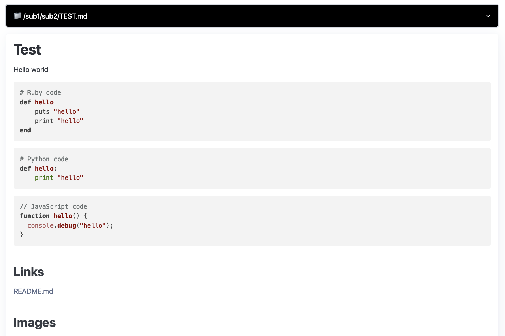

# Markdown Server

Markdown Server is a simple web server written in Go that serves `.md` files as HTML and
lists Markdown files and directories in a navigable menu. It uses the
`blackfriday` library to convert Markdown files to HTML and `Pico.css` for
basic styling.

## Features

- Serve Markdown files as HTML
- Display a navigable menu of directories and Markdown files
- Use `Pico.css` for modern, minimal styling
- Syntax highlighting for code blocks using `highlight.js`
- Custom HTML templates
- Image handling

## Installation

Binaries for MacOS, Windows, and Linux can be found on Github:
https://github.com/christianhellsten/markdown-server/releases

You can also use brew to install the binaries from Github:

```bash
brew tap christianhellsten/markdown-server https://github.com/christianhellsten/markdown-server.git
```

## Contributing

Clone the repository:

```sh
git clone https://github.com/christianhellsten/markdown-server.git
cd markdown-server
./run.sh
# or use go run main.go
```

## Screenshot


